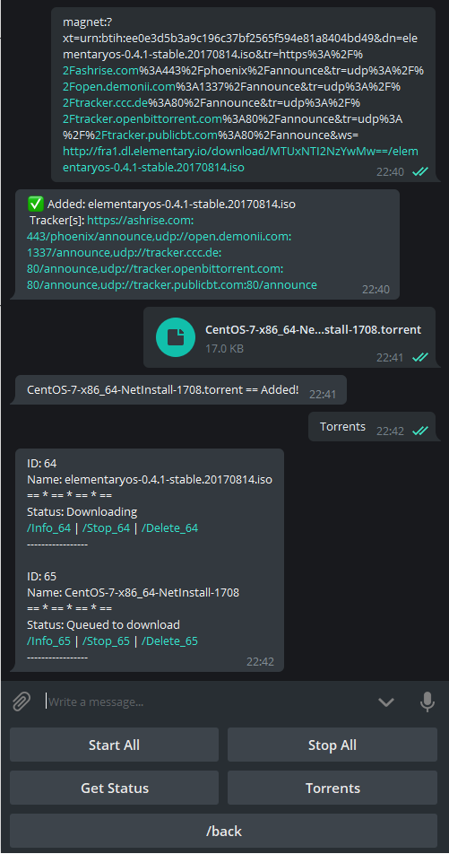
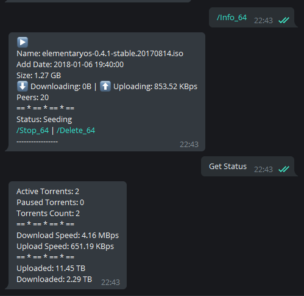

# torrBot
Telegram Bot based on [pyTelegramBotAPI](https://github.com/eternnoir/pyTelegramBotAPI)

> Work with Python 3.6 and newer 

Functions:
  - Add torrent as a magnet link
  - Add torrent by a torrent file
  - Start all downloads
  - Stop all downloads
  - Basic info about session(active, paused, count torrents, overall download and upload speed, summary of download and upload data)
  - List of torrents with status and name
  - Basic info of the selected torrent(name, add date to tracker, size, peers, status, control menu)
  - Start/Stop/Delete selected torrent

